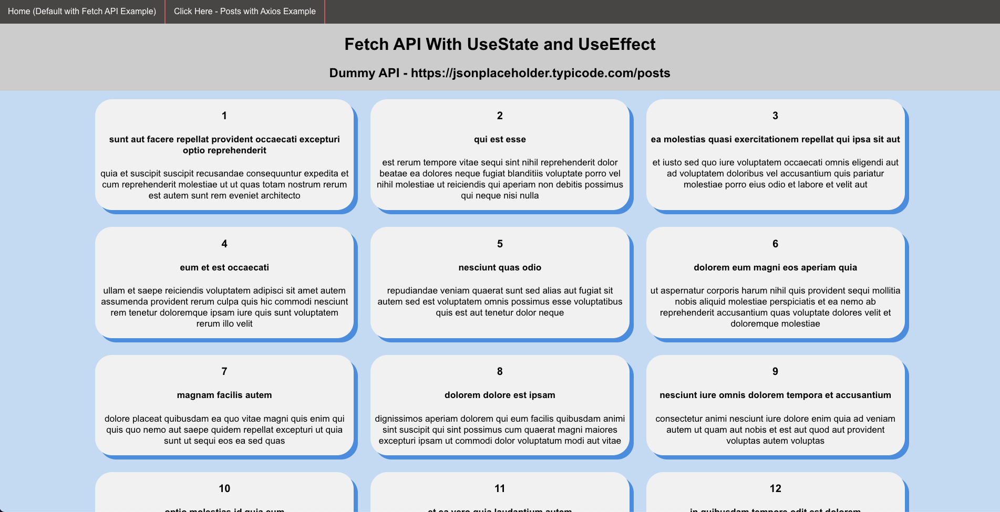
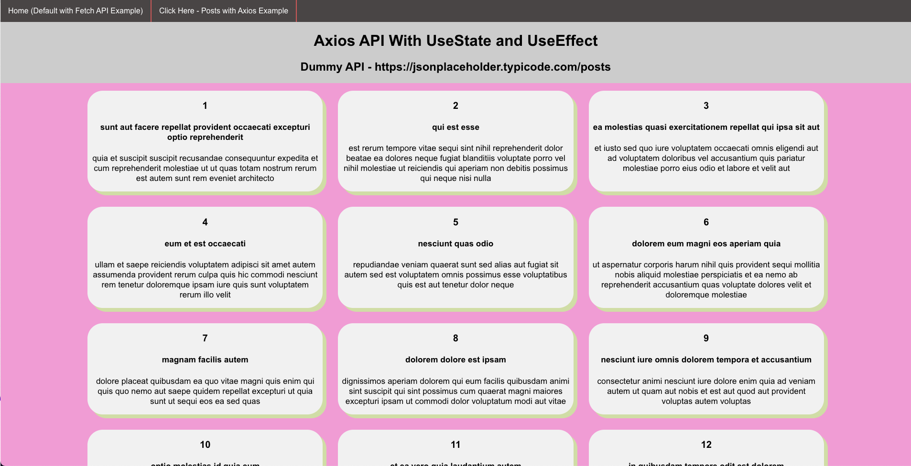

<h1 align="center">Welcome to my Simple Data Fetching (Fetch/Axios) in React Project 👋</h1>

  
  

## Screenshot

## What this project is:

A step-by-step hands-on React project provided by the [Kirti Kaushal on Medium](https://medium.com/geekculture/simple-data-fetching-in-react-with-the-fetch-api-and-axios-with-hooks-useeffect-and-usestate-85d6bd7357c2) to serve as a Beginner's Guide for working with useState and useEffect hooks to retrieve data with both Fetch API and Axios.

## Project Goals:

- Practice Data fetching in React using two methods: Fetch API and Axios.
- Practice using React hooks, specifically useState and useEffect.

## Technologies:

- React
- Axios
- Fetch API

## Author

👤 **Michael Payne**

- Website: (https://michaelspayneii.com)
- Github: [@MSPayneII](https://github.com/MSPayneII)
- LinkedIn: [@michaelspayneii](https://linkedin.com/in/michaelspayneii)
